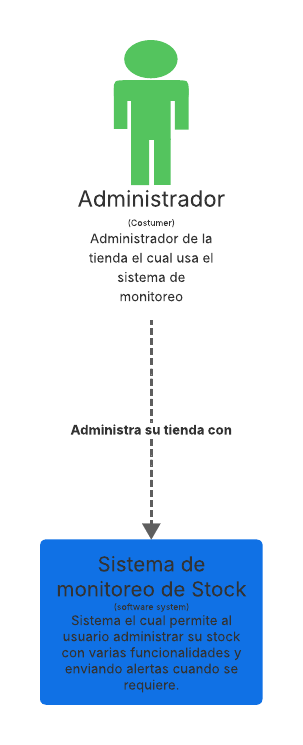
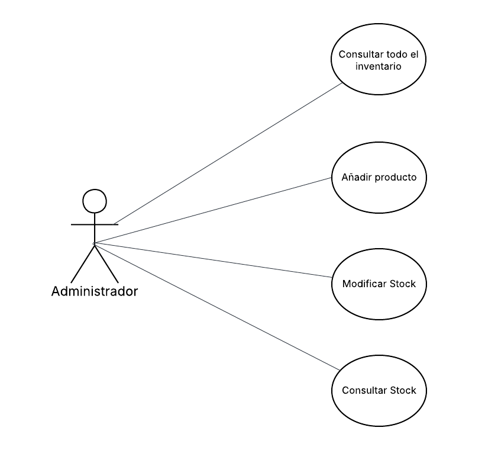
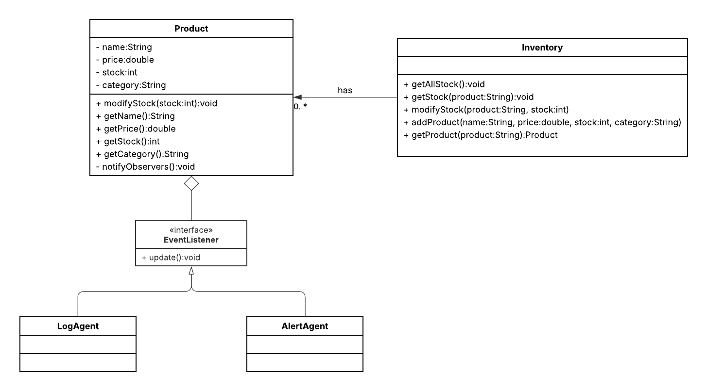
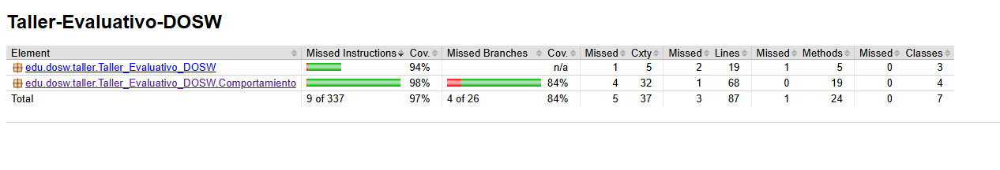
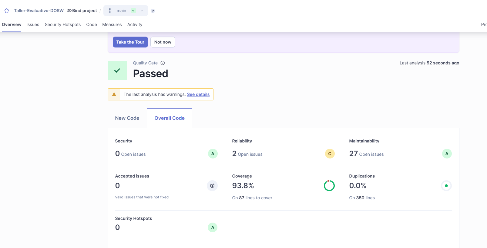

# Taller Evaluativo DOSW - Sistema de Monitoreo de Stock


## Juan Pablo Contreras Parra

---

## Descripción
Este proyecto es una aplicación desarrollada con **Maven** y **Spring Boot** que implementa un sistema de gestión y monitoreo de inventario. Permite añadir productos, modificar su stock y notificar cambios a través de agentes observadores (`AlertAgent` y `LogAgent`) utilizando el patrón Observer. El sistema genera alertas cuando el stock de un producto cae por debajo de 5 unidades y registra los niveles de stock en la consola. Está diseñado siguiendo los principios SOLID y cumple con los requerimientos funcionales del cliente.

## Patrón de Diseño
- **Patrón**: **Observer (Observador)**.
- **Razón**: Se seleccionó este patrón para notificar dinámicamente a múltiples agentes (observadores) cuando el stock de un producto cambia, desacoplando la lógica de negocio de `Product` e `Inventory` de las notificaciones. Esto permite agregar nuevos tipos de observadores (e.g., notificaciones por email) sin modificar el código existente, cumpliendo con el principio OCP (Abierto/Cerrado).

## Diagramas

### Diagrama de Contexto




### Diagrama de Casos de Uso



### Diagrama de Clases



---

## Épicas, Features y User Stories (HU) con Estimaciones
### Criterios de Aceptación
- Añadir producto con validaciones (nombre, categoría no vacíos, precio/stock no negativos).
- Modificar stock con notificación a observadores.
- Alertas para stock < 5 unidades.
- Consultas de stock individuales y totales.

### Épicas
- **Épica 1: Gestión de Inventario**
    - Features: Añadir productos, Consultar stock.
- **Épica 2: Notificación de Cambios**
    - Features: Modificar stock, Generar alertas.

### Features y HU con Estimaciones (Puntos Fibonacci)
- **Feature 1: Añadir productos**
    - HU1.1: Registrar producto (Datos válidos, único) - 3 puntos.
    - HU1.2: Consultar producto (Búsqueda case-insensitive) - 2 puntos.
    - HU1.3: Consultar inventario (Lista o vacío) - 2 puntos.
- **Feature 2: Modificar stock**
    - HU2.1: Modificar stock (Actualiza y notifica) - 3 puntos.
- **Feature 3: Notificar stock**
    - HU3.1: Imprimir stock (Al cambiar stock) - 2 puntos.
- **Feature 4: Generar alertas**
    - HU4.1: Alerta stock bajo (Si < 5) - 2 puntos.
- **Total**: 14 puntos. Plan: Sprint 1 (10 puntos): HU1.1-HU2.1. Sprint 2 (4 puntos): HU3.1-HU4.1.

## Inyección de Dependencias
El proyecto utiliza inyección de dependencias manual en `MainExecution`, donde se instancia `Inventory` con una lista de observadores (`AlertAgent` y `LogAgent`) mediante el constructor. Para una implementación más robusta con Spring, se recomienda configurar `AlertAgent` y `LogAgent` como beans con `@Component` y usar `@Autowired` en `Inventory` para inyectarlos automáticamente.

## Pruebas Unitarias y Cobertura
- **Framework**: JUnit 5 con Mockito para pruebas unitarias.
- **Clases Probadas**: `AlertAgent`, `LogAgent`, `Product`, `Inventory`, y `MainExecution`.
- **Cobertura**: Configurada con Jacoco, con un mínimo del 80%. Ejecuta `mvn test jacoco:report` para generar el informe en `target/site/jacoco/index.html`.
- **SonarQube**: Integrado para análisis de calidad. Ejecuta `mvn sonar:sonar` tras configurar SonarCloud o un servidor local.

## Evidencias de Funcionamiento
### Salida Esperada al Ejecutar `mvn spring-boot:run`
```
Producto: Laptop Stock: 10
Producto: Libro Stock: 3
Producto: Telefono Stock: 7
Laptop: 8 unidades
Libro: 4 unidades
ALERTA: Quedan menos de 5 unidades del producto Libro
Telefono: 6 unidades
Laptop Stock: 8
Libro Stock: 4
Verificación: Producto Laptop tiene stock 8
```

### Cobertura Jacoco
- Tras ejecutar `mvn test jacoco:report`, el informe en `target/site/jacoco/index.html` muestra >80% de cobertura en clases como `AlertAgent`, `LogAgent`, `Product`, e `Inventory`.



### Análisis SonarQube
- Al ejecutar `mvn sonar:sonar`, el análisis confirma la adherencia a estándares de calidad y cobertura.



### Comandos de maven necesarios
  1. mvn clean install
  2. mvn clean test